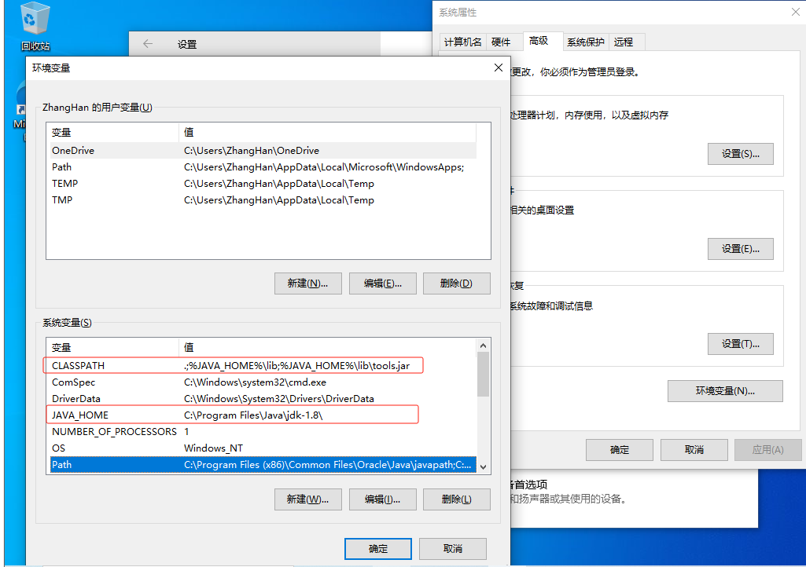
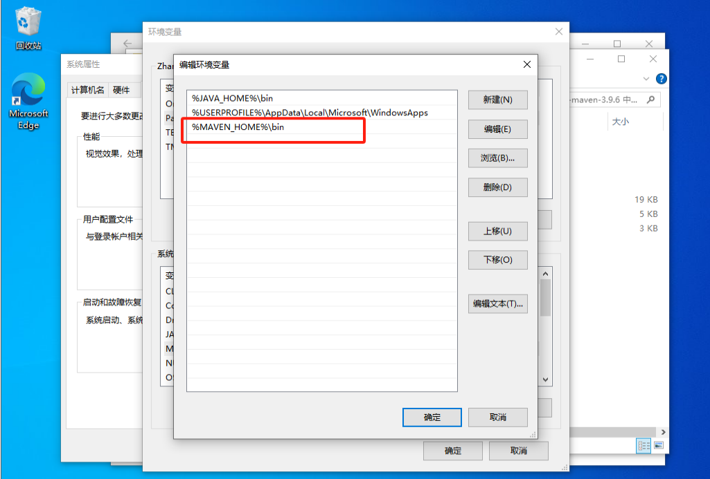
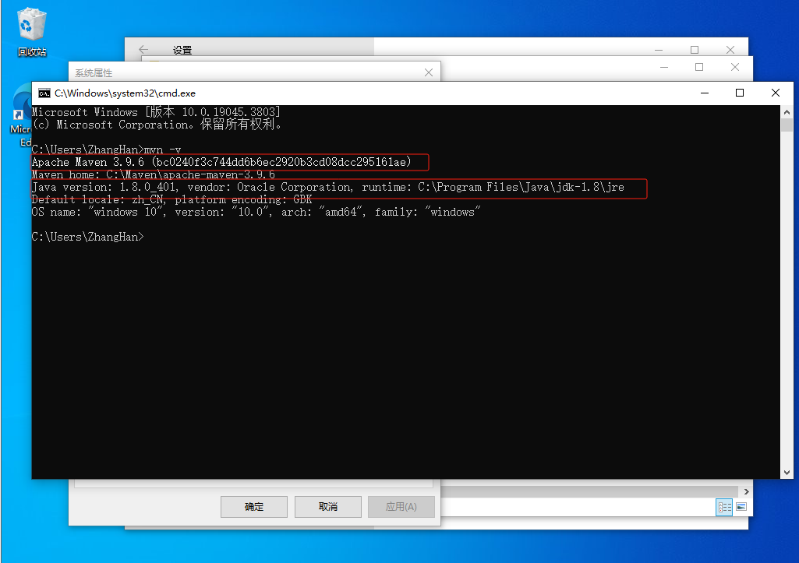

# 中高职迎新系统
## 1. 开发环境
环境：IDEA   

数据库：oracle

查看本地运行环境是否安装

需要安装的有

jdk1.8 (通过java -version和javac命令查看)

maven >= 3.9.6（通过mvn -v命令查看）

oracle >= 11g

## 2. Java环境安装

### 2.1 前往官网下载jdk，网址： [++Java Downloads++](https://www.oracle.com/cn/java/technologies/downloads/#java8-windows)

### 2.2 在该页面可以找到各版本的jdk 选择jdk1.8的x64版本进行下载安装


### 2.3 下载完jdk后双击程序进行安装，安装时记住安装路径然后默认安装即可


### 2.4 右键我的电脑点击属性或者在设置搜索环境变量然后依次点击新建环境变量

### 2.5 创建环境变量JAVA_HOME 变量名为JAVA_HOME，变量值为之前的jdk安装地址

### 2.6 创建环境变量CLASSPATH 变量名为CLASSPATH

变量值为.;%JAVA_HOME%\lib;%JAVA_HOME%\lib\tools.jar（注意最前面有一点）。




### 2.7 配置系统环境变量Path

双击Path–>新建–>添加“%JAVA_HOME%\bin”–>将这一行变量上移到最顶端–>确定完成


### 2.8 在命令行中，分别输入"java -version"、“javac”，如果出现下图提示，则表示配置成功


## 3. Maven安装

### 3.1 前往官网下载安装Maven ：[++Maven – Download Apache Maven++](https://maven.apache.org/download.cgi)

### 3.2 下载将Maven解压到一个没有中文和空格的文件夹然后配置环境变量


### 3.3 配置 MAVEN_HOME ，变量值就是你的 maven 安装的路径


### 3.4 将MAVEN_HOME 添加到Path系统变量 ：%MAVEN_HOME%\bin



通过 mvn -v命令检查 maven 是否安装成功，看到 maven 的版本为 3.6.3 及 java 版本为 jdk-1.8 即为安装 成功



### 3.5 配置Maven本地仓库

在maven解压目录中apache-maven-3.9.6\conf\settings.xml文件配置阿里云远程仓库


```xml
<mirror>
    <id>alimaven</id>
    <url>http://maven.aliyun.com/nexus/content/groups/public/</url>
    <mirrorOf>central</mirrorOf>
</mirror>
```

## 4 安装OracleXE112_Win32

官网：[++Oracle Database Express Edition 11g Release 2 (11.2.0.2.0) for Windows x64++](https://www.oracle.com/database/technologies/xe-prior-release-downloads.html)

## 5. 启动项目

### 5.1 在openedu-oms-main/src/main/resources/system.properties文件中配置数据库信息

### 5.5 启动项目

```cmd
cd openedu-oms-main
mvn jetty:run
```